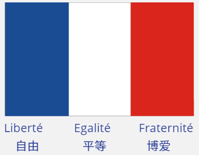

# 关于法国的文化小常识

法国: la France, 也可以被称为“神奇的六边形” （<mark>l'Hexagone</mark>）。

法国国旗 （Drapeau）从左到右颜色依次是蓝（bleu），白（blanc），红（rouge）。

法国国歌 （Hymne national）: 《马赛曲》（La Marseillaise）

法国国庆节 (Fête nationale) : 7 月 14 日 （14 jullet）
