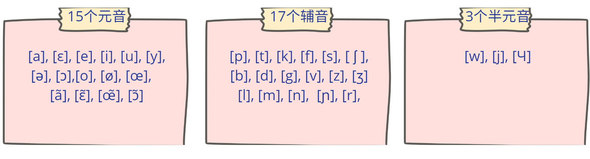

# 法语字母 A-Z

跟英语一样有 26 个字母，其中 6 个元音（粉色标注），20 个辅音 ：

可以跟视频进行练习[Alphabet français](https://www.youtube.com/watch?v=akKplmnr01M)

:::info 注意
区分 G [ʒe] 和 J [ʒi]。

区分 B [be] 和 P [pe] 以及 D [de] 和 T [te]。
B [be] 和 D [de] 的发音相对靠后，音色更浑厚，而 P [pe] 和 T [te] 的发音则靠前，带有送气音，声音更清晰。

R [εr] 小舌音 R 可以根据个人的口音适度调整，不必过于强求。可以尝试用较轻的音调来练习。

W [dublve] 可以理解为由两个 V 组成，相当于 "double V" [dubl] [ve]。

:::

## 字母发音练习

| Alphabet | Alphabet phonétique |  Exemples |
| :------- | :-----------------: | --------: |
| A        |         [a]         |      Allô |
| B        |        [be]         |      Bébé |
| C        |        [se]         |  Célébrer |
| D        |        [de]         | Decathlon |
| E        |         [a]         |    Europe |
| F        |        [be]         |    France |
| G        |         [a]         |     Géant |
| H        |        [be]         |     Hôtel |
| I        |         [a]         |        Il |
| J        |        [be]         |     Jules |
| K        |         [a]         |      Kaki |
| L        |        [be]         |       Lit |
| M        |         [a]         |     Maman |
| N        |        [be]         |       Non |
| O        |         [a]         |  Oh là là |
| P        |        [be]         |      Papa |
| Q        |         [a]         |     queue |
| R        |        [be]         |       Rue |
| S        |         [a]         |       Sac |
| T        |        [be]         |       Thé |
| U        |         [a]         |     Usine |
| V        |        [be]         |     Ville |
| W        |         [a]         |     Wagon |
| X        |        [be]         |      Taxi |
| Y        |         [a]         |      Yeux |
| Z        |        [be]         |      Zéro |

## 法语音素 （phonèmes）

音素是最小的单位（可以理解成英语中的音标）

:::info 音素和字母的区别

字母属于书面语，是书写文字的最小单位。

音标写在方括号内，每一个音标符号代表一个音素，比如：
sac [sak]
:::

## 法语音符（accents）

| 音符名称                        |           表现形式            |                         例子 |
| :------------------------------ | :---------------------------: | ---------------------------: |
| 闭音符/尖音符（l’accent aigu）  |               é               |                     été, thé |
| 开音符/顿音符（l’accent grave） |            è, à, ù            |                lèvre, là, où |
| 长音符（l’accent circonflexe）  |         â, ê, î, û, ô         | âge, forêt, île, hôtel, août |
| 分音符（l’accent tréma）        | ë, ï 表示与前面的元音分开发音 |                   Noël, maïs |
| 软音符（la cédille）            |         ç, 发 s 的音          |          ça, français, leçon |
