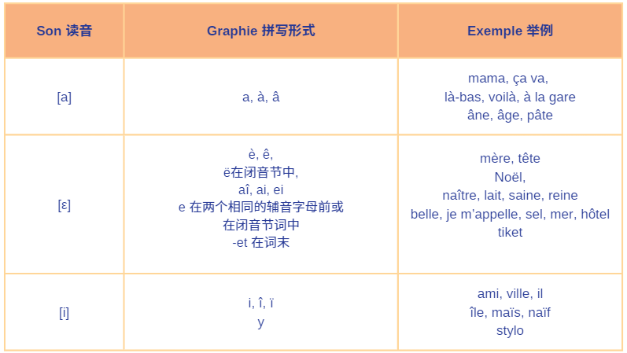
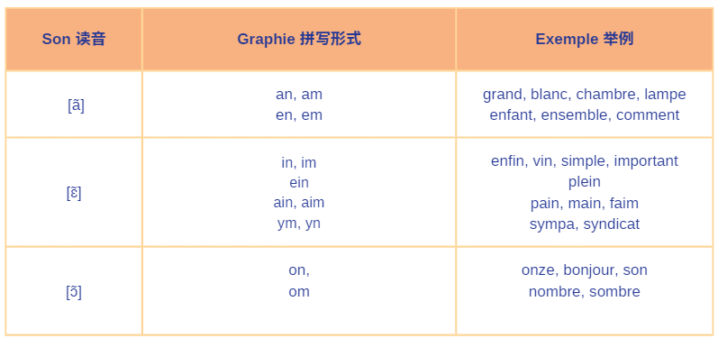
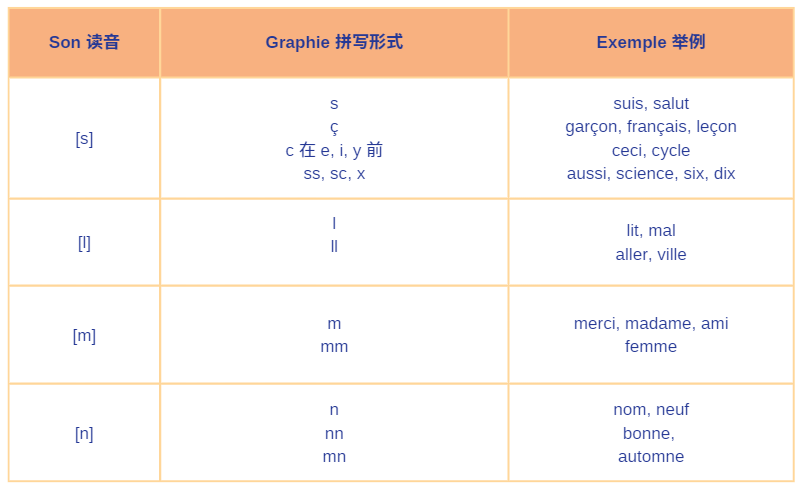

# O 单元课前准备

在开始课程之前，我们先了解几个发音及其规则。

**元音(Voyelle) - [a],[ε],[i]**

**鼻化元音(Voyelles nasales) - [ã],[ɛ̃],[ɔ̃]**

**辅音(Consonnes) - [s], [l], [m], [n]**

<!-- ## 发音规则

-   元音字母 e 在词尾不发音 (注意：在没有任何特殊符号的时候);

-   两个相同的辅音字母放在一起，通常只读一个音, 如: homme [ɔm];

-   词尾辅音接元音 e 时，辅音要发音，e 不发音,
    如 petite [pətit], grande [grɑ̃d];

-   单独 h 不发音，但和 ch 组合发[ ʃ ]的音，如：Chine [ʃin];

-   大部分辅音在词尾不发音，如 salut [saly]，t 不发音，grand [ɡʁɑ̃]，d 不发音 ;

:::info 凡事总有例外 😕
**通常发音的辅音**
**q, c, f, l, r** 通常要发音，如 coq [kɔk],
sac [sak]，public [pyblik],
vif [vif]，neuf [nœf],
canal [kanal]，animal [animal],
hiver [ivɛʁ]

**例外情况**

-   **f 不发音**：clef [kle]（钥匙，f 不发音，现代拼写多用 clé）。

-   **r 不发音**：monsieur [məsjø]（r 不发音）。

此外，某些外来词或特殊拼写的词中，词末的辅音字母会发音，如： bus [bys], film[film], watt[wat]
:::

看到这么多规则和例外，可能会让你感到法语很难，其实并不然。只要多看、多读、多练习，在实际生活中经常接触和使用不同的词汇，慢慢地你就能自然地将它们融入你的记忆中 😊。

## Les consignes en classe 课堂用语

在课上，我们会经常听到或看到以下词汇，需要你们能够熟记下来。

-   écouter 听
-   répéter 重复
-   parlez / dites 说
-   écrivez 写
-   regardez 看
-   lisez 读

:::info 动词变位
注意以上动词都是以 vous 为人称的变位动词，动词原形依次是: écouter, répéter, parler/dire, écrire, regarder, lire。

关于动词变位的规则我们会在之后的课程中讲到。
::: -->
