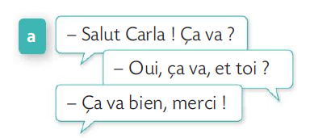
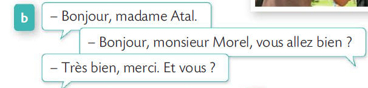
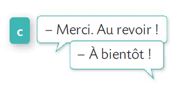
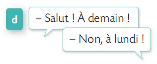
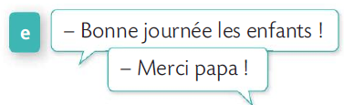

# 第 0 单元 - Bienvenue!

## Partie A : C'est en français ! 这就是法语

这一部分的主要学习目标是帮助学生熟悉法语发音，通过听力练习将听到的单词与对应的图片联系起来。这有助于初学者培养对法语的初步语感，并运用已有的语言知识进行图文匹配，进一步增强对法语词汇的认知。

### Vocabulaires 词汇扩展

**hôtel** [otεl] n.m 酒店

**chocolat** [ʃɔkɔla] n.m / adj 巧克力

**restaurant** [ʀɛstoʀɑ̃] n.m 餐厅

**cinéma** [sinema] n.m 电影院

**croissant** [kʀwasɑ̃] n.m 可颂，牛角面包

**train** [tʀɛ̃] n.m 火车

**toilettes** [twalɛt] n.f 卫生间

## Partie B : Bonjour, ça va ? 你好，你好吗？

这一部分的主要学习目标是帮助学生掌握法语中的常见问候与告别表达方式。学生通过对话场景练习如何与他人打招呼、询问对方的状态以及告别。这些内容不仅包括常规的问候（如“Bonjour”）和常见的回应（如“Ça va”），还涵盖了法语中与不同对象（朋友、家人、陌生人等）互动时应使用的礼貌形式。

此外，这部分还训练了社交场合中的基本礼仪，例如握手(serrer la main)或亲吻礼（faire la bise）的使用场合，以帮助学生在实际交流中正确运用这些礼仪。

### 听力短文翻译

—— 嗨，卡拉! 你好吗？

—— 是，我很好，你呢？

—— 我很好，谢谢！

—— 您好，阿塔尔女士。

—— 您好，莫雷尔先生，您好吗？

—— 我很好，谢谢。您呢？

—— 谢谢，再见!

—— 回头见!

—— 再见! 明天见!

—— 不，周一见！

—— 祝你们愉快，孩子们 !

—— 谢谢爸爸 ！

### 在法国如何打招呼呢？

| 打招呼用语                                 |          适用场合          |                       人际关系 |                                                       使用场合 |                                                                                             例子 |
| :----------------------------------------- | :------------------------: | -----------------------------: | -------------------------------------------------------------: | -----------------------------------------------------------------------------------------------: |
| **Bonjour / Bonsoir**                      |      正式或非正式场合      |                       任何关系 |                             白天使用 bonjour, 晚上使用 bonsoir |                                               商店等公共场所；商业会议，工作场合；对不太熟悉的人 |
| **Salut**                                  |         非正式场合         | 熟悉的朋友、同学、同事和家人等 |                        相当于英语中的 Hi，用于和熟人随意打招呼 |                                                             不适用于正式场合或对年长者、上司等。 |
| **Coucou**                                 |         非正式场合         |             朋友、熟人之间使用 |                   这个词带有可爱轻松的感觉，通常用于口语或短信 |                                                       跟密友或孩子打招呼，是一种跟亲切的问候方式 |
| **ça va ?/ Comment ça va ?**               | 非正式场合或某些版正式场合 |               朋友，同事，熟人 | 很常见的问候方式，用于表达关心，可独立使用，也可做问候语的后续 | 见面时 salut, ça va ? 相当于英语中的 Hi, how are you ？ 工作场合中也可以跟同事随意问一句 ça va ? |
| **Au revoir**                              |          任何场合          |                         任何人 |                                     结束对话或离开时的告别用语 |                                                     离开商店时跟店员说 Au revoir, bonne journée! |
| **Salut/Ciao**                             |         非正式场合         |                       熟人之间 |                                     结束对话或离开时的告别用语 |                                                                 下课时跟同学说再见 salut 或 ciao |
| **à bientôt/à plus tard/à tout à l'heure** |      更适合非正式场合      |                       熟人之间 |           表示短时间内会再见到对方，通常是双方有预期很快会见面 |    在工作场合下班前对同事说 à bientôt/à plus tard/；跟朋友说再见时说 à tout à l'heure 表示稍后见 |

:::info 握手还是亲吻礼 （Serrer la main ou faire la bise） ？

在法国，打招呼的方式一般有两种：握手和亲吻礼。选择哪种方式取决于具体的场合和人际关系。

-   **商业或正式环境：**

    在正式场合，应选择握手作为打招呼的方式。握手时，务必注视对方的眼睛，这被视为对对方的尊重与礼貌。同时，使用 **vous**（您）来称呼对方，以体现正式性。

-   **亲友、熟人或同事之间：**

    在与亲友或熟人见面时，通常会采用亲吻礼。亲吻时，轻轻地在对方的脸颊两侧“空气吻”。亲吻的次数可能因地区而异，通常为两次，但在某些地区可能是三次或四次。在这种情况下，通常使用 tu（你）来称呼对方，显得更为亲密。
    :::

### Vocabulaires 词汇扩展

**bonjour** [bɔ̃ʒuʁ] 您好

**salut** [saly] 你好/再见

**madame** [madam] n 女士/夫人

**monsieur** [mɔ̃sjø] n 先生

**merci** [mɛʁsi] 谢谢

**à demain** [a-dəmɛ̃] 明天见

**au revoir** [o- ʁəvwaʁ] 再见

**bonne journée** [bɔn-ʒuʁne] 祝你有美好的一天

**enfant** [ɑ̃fɑ̃] n 孩子

**papa** [papa] n 爸爸

**ami(e)** [ami] n 朋友

**inconnu(e)** [ɛ̃kɔny] n 陌生人

**famille** [fa.mij] n.f 家庭， 家人

## Partie C : L'alphabet 字母表

参考[法语字母 A-Z](./02-alphabet.md)章节。

## Partie D : Je m'appelle... 我叫……
