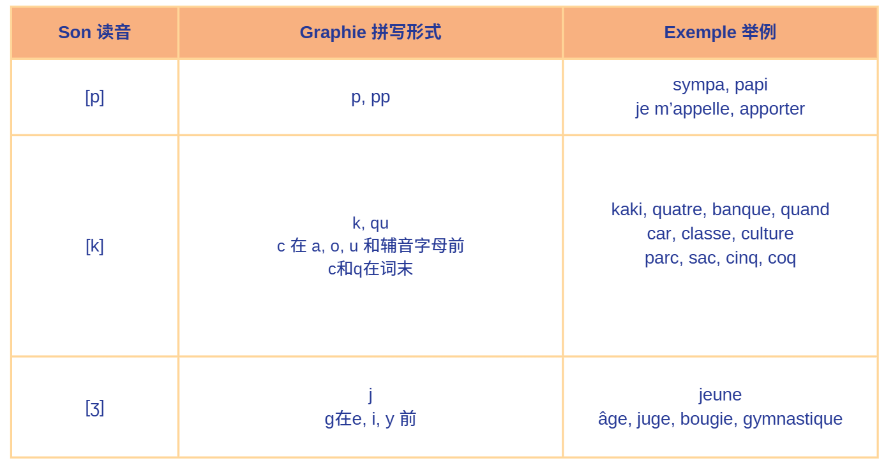

# 课前准备

在本单元中，我们将重点学习如何进行自我介绍，询问和提供个人信息，包括兴趣爱好、年龄和国籍。我们还将初步接触法语动词的变位，尤其是第一组动词的变位规则。同时，我们会学习表示国籍的阴阳性变化，以及国家或城市名称前介词的正确使用。

在开始之前，我们还是继续学习 8 个音素的发音规则。

**元音(Voyelle) - [e],[ə],[ɔ]**

**辅音(Consonnes) - [p], [k], [ʒ]**

**半元音(semi-voyelle) - [w], [wa]**

