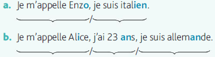

# 第 1 单元 - 定冠词与节奏组

## Partie B : Langues en duo 双人语言学习

### Vocabulaires 词汇扩展

**loisir** [lwazir] n.m. 休闲，娱乐

**aimer** [ɛme] v. 喜欢，爱

**musique** [myzik] n.f. 音乐

**cinéma** [sinema] n.m. 电影院

**sport** [spɔr] n.m. 运动

**art** [ar] n.m. 艺术

**langue** [lɑ̃ɡ] n.f. 语言

## Grammaire : Les articles définis le, la, l’, les (语法 ：定冠词 le, la, l’, les)

### 定冠词的形式

在法语中，定冠词（le、la、les）的使用范围非常广泛。它不仅用来表示特指对象，还可以在一些特定场合表泛指、抽象概念等。

我们先来看一下定冠词的不同形式：

| 阳性单数 | 阴性单数 | 复数（阴阳性一致） |
| :------- | :------: | -----------------: |
| le/l'    |  la/l'   |                les |

:::info 定冠词的缩合

-   在**元音**或**哑音 h** 前，有元音省音，le/la 写成 l’

例如：l’art, l’histoire, l’hôtel

-   注意：在**虚音 h** 前，不能有元音省音或进行联诵。

例如：le héros, la hauteur;
les Halls, les haricots

:::

### 定冠词的用法

-   **表示普遍性概念时**

定冠词用于表示具有普遍性或广泛意义的名词，如：

         L’argent ne fait pas le bonheur.
         (金钱并不能带来幸福。)

         Les jeunes adorent les jeux vidéo.
         (年轻人喜欢电子游戏。)

         La liberté est précieuse. (自由是珍贵的。)

-   **国家或地理名词前**

法语中大部分国家和地理名词需要使用定冠词：

         l’Europe, la France, l’Italie, la Chine, les Alpes, le Nil, la Normandie, etc.

         La France est un pays magnifique. (法国是一个美丽的国家。)

:::note 小提示

-   大部分以 -e 结尾的国家名词为阴性，但也有例外，如: le Mexique, le Cambodge, le Zimbabwe。

-   以 -s 结尾的国家名称一般用复数定冠词，如：
    les États-Unis, les Pays-Bas.

-   某些国家名称前不用冠词，如：
    Cuba, Israël 等.

:::

-   **表示已知的或独一无二的人或物**

定冠词用于指出已知的或唯一的事物 ：

       Le Soleil éclaire la Terre.
       (太阳照亮地球。)

       Le président de la France est Macron.
       (法国的总统是马克龙。)

-   **季节，日期和节日前**

表示季节、日期和节日的名词前通常使用定冠词:

       l’été, l’hiver;

       le 14 juillet, le mardi 9 mai;

       la Toussaint, le jour de l’an

       :::note 注意
      在节日名称中，Noël 和 Pâques 通常不使用定冠词，除非有补充说明或为了强调特定含义。例如：

      - Le Noël de mon enfance était magique.
        （我童年的圣诞节充满魔力。）

      此处指的是我童年时期的圣诞节，即特定的一个时间段。

-   Le Pâques de cette année a été très spécial.
    （今年的复活节非常特别。）

        此处强调的是今年特定的复活节。
        :::

        :::tip 小提示

-   在表示**习惯性动作**时，定冠词放在星期几或早晨、中午、晚上等时间词前。例如：
    Je fais du sport le dimanche.
    （我每周日做运动。）

-   对比用法：如果是表示某个特定的周日，则不加定冠词：
    Je fais du sport dimanche avec mes amis.（我这周日和朋友一起做运动。）

通过是否使用定冠词，可以区分**习惯性动作**和**特定的时间**。

    :::

## Les groupes rythmiques et la place de l’accent tonique 节奏组和重音位置

在法语中，节奏组和重音位置是发音和节奏的关键概念。理解这两个概念可以帮助你更自然地掌握法语语流和语调。

### 节奏组（Groupe rythmique）

节奏组是法语中自然的发音单位，可以按照意义和语法结构划分为节奏组。

节奏组一般以实词(动词，名词等)为主体，一切辅助词都和有关实词共同构成节奏组。

节奏组在发音时尽量不做停顿，形成一个流畅的整体。

观察下面的两句话：

第一句话分成两个节奏组，第二句话分成三个节奏组。每个节奏组是一个含义完整的小单位。

法语的节奏组比较短，会使语言的节奏感更强。这个分组习惯让法语听起来有一种“分段式”的韵律感。

### 重音位置（Accentuation）

在法语中，重音始终位于**节奏组的最后一个音节**。法语的重音不像英语那样分散在词内的某个特定音节上，而是遵循**组尾重音**的原则，强调节奏组的最后一个音节。这种规律让法语的语调显得有节奏感。

### 节奏组划分原则 1: 动词性结构
